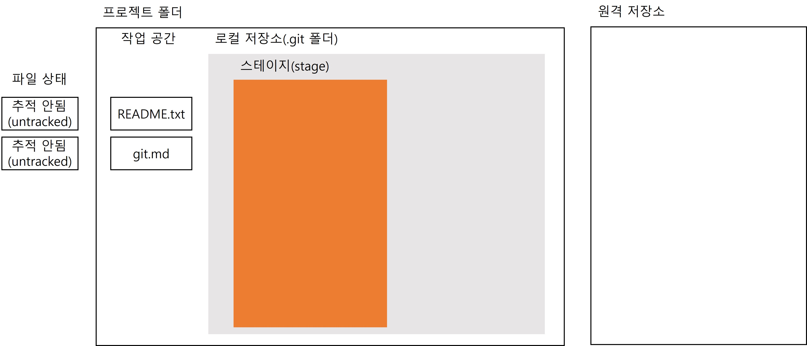
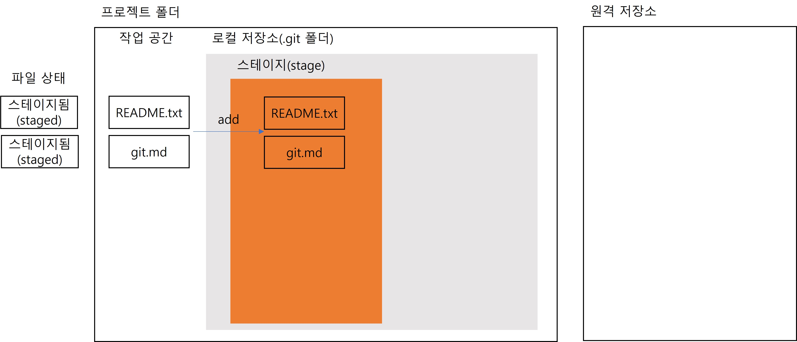
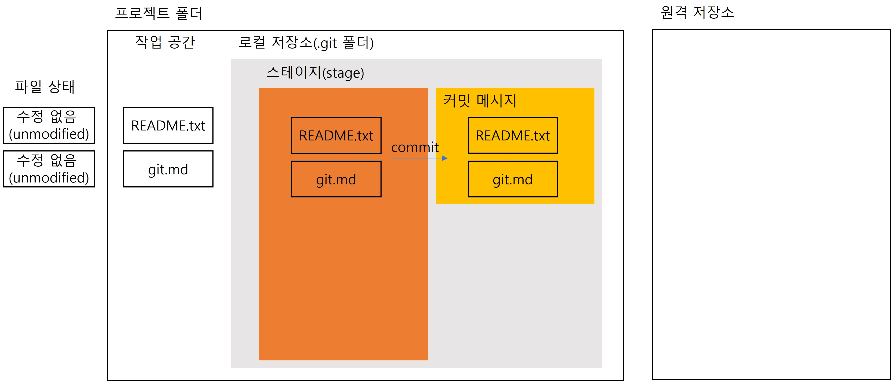
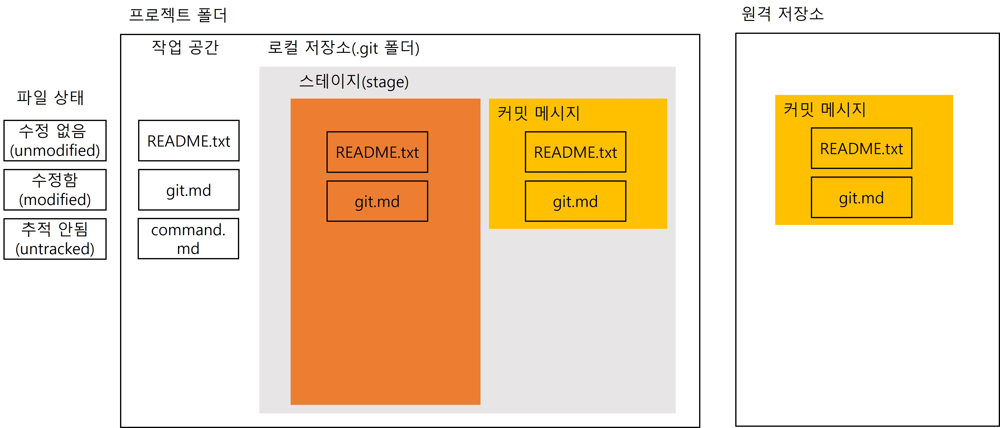

# 1. Git 이해하기
## 1. Git에서의 commit 이해하기
1. 하나의 버전을 만들기 위해 변경사항들을 선택하는 과정을 add
2. 선택된 변경사항들을 하나로 묶어서 버전을 만드는 것이 commit이라고 했다.
3. commit을 변경사항의 묶음을 저장한 것이라고 생각하면 오산이다.
4. 사실 commit은 변경사항만 저장하는 게 아니라 기존 파일들과 변경된 파일들을 포함한 프로젝트 전체를 저장한다.
5. Git이 상용화되기 전에는 SVN(SubVersioN)이라는 버전 관리 프로그램을 주로 사용했는데 SVN에서는 commit이 차이점(Delta)만 저장을 했고 Git에서는 commit이 SnapShot(스냅샷) 전체 프로젝트를 저장한다.
    - 
    - 
6. 차이점만 저장하는 SVN이 훨씬 용량도 적고 빠를 것 같지만 SVN은 버전을 보여줄 때 처음 파일이 생성한 시점까지 거슬러 올라가서 모든 커밋들을 읽어오는 연산을 해야한다. README.txt파일 100번 커밋돼서 100번 변경됐으면 100번의 차이점을 모두 비교해야해서 읽어오는 연산이 필요하다.
7. SnapShot을 저장하는 Git은 SVN같은 연산이 필요없고 바로 이전의 commit과 비교하는 연산 한 번이면 끝이다. 변경되지 않은 파일은 이전 파일의 링크만 저장하기 때문에 용량도 적고 연산도 훨씬 빠르다. Git은 이러한 특성때문에 복잡한 명령어들을 빠르게 처리할 수 있다.

## 2. Git으로 관리하는 파일의 4가지 상태
1. 처음 프로젝트 폴더에 로컬 저장소를 생성하고 README.txt와 git.md 파일을 생성했다고 가정.
2. 두 파일 모두 한 번도 commit이 되지 않은 상태이기 때문에 파일 상태는 '추적 안됨(untracked)'이다.
    - 
3. add 명령어를 통해 두 파일을 모두 스테이지에 올린다. 파일 상태는 '추적 안됨(untracked)'에서 '스테이지됨(staged)'로 변경.
    - 
4. 스테이지에 있는 파일 전체를 commit 명령어를 통해서 하나의 SnapShot, 즉 버전으로 만든다. 파일 상태는 '스테이지됨(staged)'에서 '수정 없음(unmodified)'로 변경. '수정 없음(unmodified)' 상태인 파일들은 다른 수정을 할 수 있다.
    - 
5. 협업을 하기 위해 push 명령어로 원격 저장소에 올린다.
    - 
6. git.md 파일을 수정해서 파일 상태를 '수정 없음(unmodified)'에서 '수정함(modified)' 상태로 변경하고 command.md 파일을 하나 새로 만들어준다. 파일을 새로 추가하면 초기 상태는 '추적 없음(untracked)'상태.
    - 
7. README.txt 파일은 '수정 없음(unmodified)'상태라 이미 stage에 올라가 있고 add 명령어로는 '수정함(modified)'상태인 git.md 파일과 '추적 없음(untracked)'상태인 command.md파일만 stage에 올라간다. add 명령어로 git.md파일과 command.md파일이 '스테이지됨(staged)'상태로 변경된다.
    - 
8. commit을 통해 SnapShot을 만든다. 이번 commit은 첫 번째 commit과 연결되어 있다. 앞 commit에 비해 git.md파일이 수정되었고 commamd.md파일이 추가된 것을 Git은 연산을 통해서 알 수 있다. commit이 일어나면서 모든 파일의 상태가 '수정 없음(unmodified)'상태로 변경.
    - 
9. push까지 진행해서 원격 저장소에 새로운 버전도 올려준다.
    - 
10. 종합적으로 Git은 아래와 같은 네 가지 상태를 가지고 파일을 관리하게 된다.
    - 