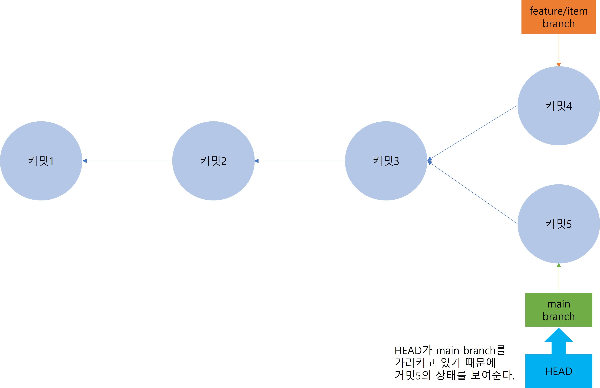
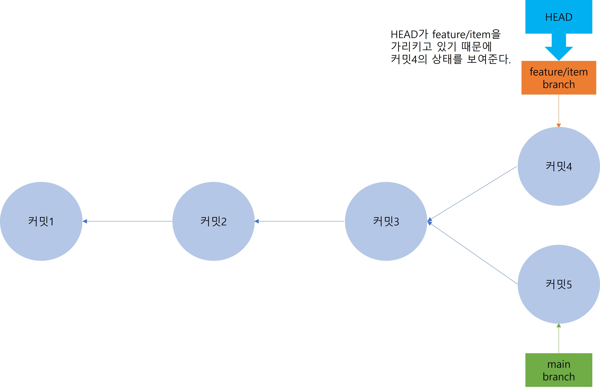
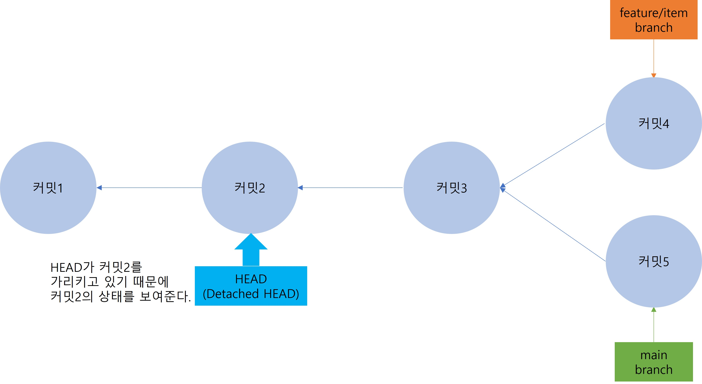

# 1. branch
## 1. 여러명이 동시에 버전 관리
1. 1시에 개발자1은 README.txt, git.md, command.md파일을 작성하고, 동시에 개발자2는 branch.md파일을 작성한다.
2. 2시에 개발자1을 작성을 완료하고 개발자1-버전1로 저장
3. 개발자2는 개발자1-버전1을 가져와서 본인이 작성한 branch.md파일을 추가한 후 개발자2-버전1로 저장
4. 3시에 개발자1이 git.md파일을 수정해서 개발자1-버전2로 저장
5. 개발자2는 개발자2-버전1과 개발자1-버전1을 비교하여 git.md파일이 바뀐 걸 확인 후 반영하여 개발자2-버전2로 저장
    - 
6. 여러 명이 동시에 버전 관리를 할 때도 서로의 작업물에 의존하지 않고 내가 원할 때 코드를 올리고 내가 원할 때 협업자의 코드를 받아와서 합칠 수 있다.

## 2. Git이 커밋을 관리하는 방식
1. 코드의 변경사항을 하나의 덩어리로 만드는 것을 커밋이라고 한다. 커밋은 기차처럼 계속 연결되어 있다. 새로 만든 커밋은 기존 커밋 다음에 시간순으로 쌓인다.
    - 
    - 한 명이 작업한다면 위 그림처럼 게속 커밋을 쌓아가면 된다.
2. 여러 명이 함께 작업한다면 커밋을 한 줄로 쌓아가지 못하고 자연스레 두 줄로 갈래가 나뉘게 된다. 이렇게 특정 기준에서 줄기를 나누어 작업할 수 있는 기능을 branch라고 한다. 새로운 가지로 커밋을 만드려면 반드시 branch를 먼저 만들어야 한다. branch를 만들지 않고 여러 명이 한 줄로 작업하게 되면 에러가 발생한다.
    - 
    - 커밋4은 원격 저장소에 정상적으로 담기지만 커밋5가 최신 커밋인 커밋4를 가리키고 있지 않기 때문에 커밋5를 올릴 때 '최신 코드에 푸시하라'는 오류가 발생한다.

## 3. Git branch
1. GitHub에서 기본으로 제공하는 branch는 main이다.
    - 
2. 첫 번째 커밋을 하면 자동으로 [main] branch가 커밋을 가리키게 만든다. 새로운 커밋을 올리면 [main] branch는 새로운 커밋을 가리키게 된다.
    - 
3. branch는 나뭇가지처럼 물리적으로 길이 존재해서 그 길에 올리는 것이 아니라 단순한 포인터의 역할만 한다. 순서대로 커밋1, 커밋2, 커밋3을 만들었다고 생각해보면 새로 커밋할 때마다 [main] branch의 포인터가 최신 커밋을 가리키게 된다.
    - 
4. 커밋3 상태에서 [feature/item]이라는 branch를 생성하면 [main] branch와 동일하게 커밋3을 가리키게 된다.
    - 
5. branch가 물리적이고 독립적인 가지였다면 [main] branch와 [feature/item] branch 별로 커밋을 새로 올렸여야 했겠지만 branch가 포인터이기 때문에 그저 커밋을 가리키는 것만으로도 분기를 만들 수 있다. SVN은 분기를 만드려면 프로젝트를 통째로 복사해야 해서 무겁고 시간이 오래 걸리지만 Git은 분기(branch)가 포인터로 역할만 하기 때문에 가볍고 빠르다는 장점이 존재한다.
6. [feature/item] branch에서 커밋을 하나 더 올리면 아래의 그림과 같이 [main] branch보다 커밋이 하나만큼 앞선 상태가 된다.
    - 
7. [main] branch로 돌아가서 커밋을 하나 더 하게되면 커밋3을 기준으로 갈라지게 된다. 커밋3 기준(base)으로 두 가지 버전이 생기게 된다.
    - 
8. 내 컴퓨터에서 [feature/item] branch와 [main] branch 사이를 넘나들수 있는 방법은 [HEAD]라는 특수한 포인터가 존재하기 때문이다. [HEAD]라는 특수한 포인터는 branch나 commit을 가르킬수 있는 포인터이다. [HEAD]를 이용하면 branch 사이를 마음대로 넘나들 수 있다.
    - 
    - 
9. 최신 커밋이 아닌 과거 커밋으로도 [HEAD]를 이동시킬 수 있다. 다만, 이 경우에는 [main] branch의 포인터와 [HEAD]가 떨어져있어서 'Detachedc HEAD(분리된 HEAD)'상태가 된다.
    - 

## 4. branch 생성
1. D:\lecture\git\Ex05_Branch 폴더 생성
2. Source Tree에서 New Tab 열어서 Create 클릭
    - 
3. 탐색 버튼 클릭 후 Ex05_Branch 폴더 선택
    - 
4. 정보 입력 후 생성버튼 클릭
    - 
5. README.txt 파일 생성 후 Git Example 05 입력 후 저장
6. D:\lecture\git\Ex04_SourceTree 폴더에 있는 git command.md 파일 복사해서 D:\lecture\git\Ex05_Branch 폴더에 붙여넣기
    - 
7. Source Tree에서 commit, push하기(커밋 메시지는 24.04.01 고기천 Git Example05-Branch)
8. README.txt 파일 Git Example 05 - Branch로 수정 후 commit, push하기(커밋 메시지는 24.04.01 고기천 README.txt 파일 수정)
9. vs code에서 D:\lecture\git\Ex05_Branch 선택 후 New File 만들기 후 branch.md로 파일명 지정
10. 아래 내용 입력 후 저장
```
# 1. branch
1. 여러 명이 협업할 때 커밋을 기준으로 분기를 따서 작업할 수 있는 기능을 브랜치라고 한다.
```
11. 다시 한 번 commit, push 하기(커밋 메시지는 24.04.01 고기천 branch.md 파일 추가)
    - 
12. [main] branch 최신 커밋 기준으로 branch를 생성할 건데 항상 Git으로 협업할 때는 규칙들이 필요하다. 따라서 branch를 생성하기 전에 규칙을 지정한다. 규칙은 프로젝트에 따라 달라진다.
    - [main] branch에는 직접 커밋을 올리지 않는다.
    - 기능을 개발하기 전에 [main] branch 기준으로 새로운 branch를 만든다.
    - branch 이름은 [feature/기능이름] 형식으로 하고 한 명만 커밋한다.(다른 프로젝트에서는 [feature/날짜] 형식으로 하는 곳도 있고 feature 빼고 [날짜나 기능이름]으로 하는 프로젝트도 있다)
    - [feature/기능이름] branch에서 개발이 완료되면 [main] branch에 이를 합친다.(다른 프로젝트에서는 [main] branch를 아예 안 쓰는 곳도 있다. [dev]나 [날짜]별로 코드를 합치는 곳도 있다.)
13. [feature/기능이름] branch를 만들고 작업이 완료되면 [main] branch에 각자 합치는 전략이다. 결국 [main] branch에 commit을 하지 않고도 [main] branch에는 모든 작업자들이 작업한 내용이 합쳐지게 될 것이다.
14. Source Tree에서 브랜치 버튼 클릭. 팝업에서 새 브랜치 이름에 [feature/checkout]라고 입력 하고 새 브랜치 체크아웃 체크 후 브랜치생성 클릭. 현재 branch는 [main]이기 때문에 체크박스를 체크하면 새로 만들어진 branch로 이동한다.
    - 
15. [feature/checkout] branch가 생성됐고 24.04.01 고기천 branch.md 파일 추가 커밋을 가리키고 있다. Source Tree 좌측 사이드 바의 브랜치 항목을 보면 [feature]아래 [checkout] branch가 선택되어 두껍게 표시되고 있는 걸 확인할 수 있다. branch이름에 '/'를 넣으면 폴더처럼 구분되어 보여진다. 이 기능은 Source Tree의 편의성 기능이다. 사실은 [feature/checkout] branch로 선택되어 있는 것이다.
    - 
16. vs code로 돌아와서 New File 선택해서 checkout.md 파일 생성하고 아래 내용 입력 후 저장
```
# 1. checkout
1. checkout은 branch를 이동하거나 HEAD를 이전 commit으로 옮기는 명령어
2. Source Tree에서는 좌측 사이드바의 브랜치 항목에서 해당 브랜치를 더블 클릭하면 자동으로 checkout된다.
```
17. Source Tree에서 커밋(커밋메시지는 24.04.01 고기천 checkout.md 파일 추가)
18. vs code에서 branch.md 파일에 아래 내용 추가 후 저장
```
2. branch를 생성하기 전에 협업하는 사람끼리의 규칙을 항상 지정한다.(branch 명명규칙, commit 하는 방식 등)
```
19. Source Tree에서 커밋(커밋메시지는 24.04.01 고기천 branch.md 파일에 2번 내용 추가)
20. push 실행. 현재 생성한 [feature/checkout] branch는 로컬 저장소에만 생성되어 있고 원격 저장소에는 없는 상태이다. push를 하게되면 branch도 원격 저장소에 생성되게 된다.
    - 
21. 원격 저장소에서 branch 생성 확인
    - 
22. 원격 저장소에서 branch 이동 후 push된 내용 확인
    - 

## 5. branch 이동
1. 지금까지 고기천이 [main] branch와 [feature/checkout] branch에서 작업을 진행했다. 다른 개발자인 홍길동이 작업을 진행하려면 새로운 branch를 만들어서 작업해야 한다. 이 때는 [main] branch로 돌아가서 새로운 branch를 만들어야 한다. [feature/checkout] branch에서 새로운 branch를 만들게 되면 고기천이 작업한 내용까지 수정되는 문제가 생기기 때문이다. 따라서 새로운 branch를 만들 때는 base branch를 잘 설정해야 한다.
2. branch를 이동하는 명령어는 checkout이다. Source Tree에서는 좌측 사이드바에서 checkout 하려는 branch 오른쪽 클릭 후 체크아웃하거나 checkout 하려는 branch를 더블 클릭한다.
    - 
3. [main] branch로 checkout한다. checkout되면 chekcout된 branch가 두꺼운 글씨로 표시된다.
    - 
4. 새로운 branch 생성. branch 이름은 [feature/merge].
    - 
5. vs code로 돌아와서 branch.md 파일에 아래 내용 추가하고 저장
```
2. branch 하나에는 한 명만 commit한다.
```
6. merge.md 파일 생성해서 아래 내용 추가하고 저장
```
# 1. merge
1. merge는 branch끼리 코드를 병합하는 과정 또는 명령어.
```
7. Source Tree에서 commit, push 진행
    - 
8. 두 갈래의 branch가 생성된 것을 확인.
    - 
9. 현재 branch 상황의 도식화
    - 