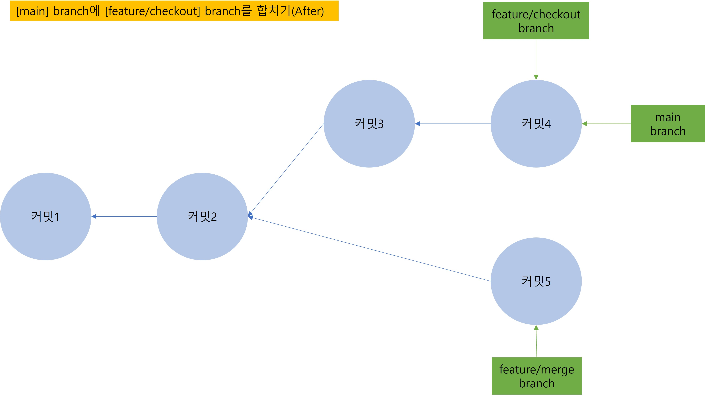
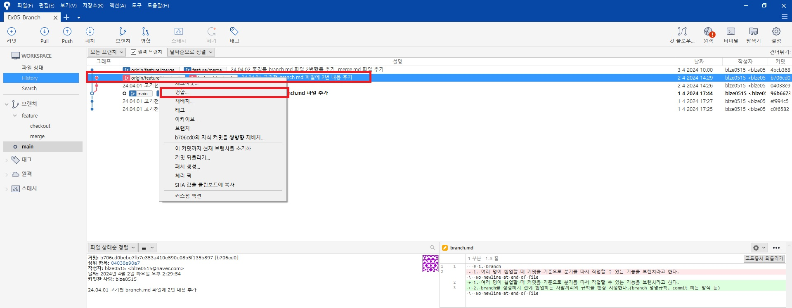

# 1. merge
## 1. branch와 branch 합치기
1. [feature/checkout] branch와 [feature/merge] branch를 각각 만들어서 병렬로 작업했다. 이렇게 나눠서 작업을 한 코드를 합치는 작업을 병합이라 한다.

## 2. merge(병합)이란?
1. merge(병합)은 간단히 말하면 두 버전의 합집합을 구하는 것이다.
    - 

## 3. 두 개의 branch를 합치는 과정
1. Git에서 branch와 branch 합치는 명령어는 merge이고 번역하면 병합이라는 뜻이다.
2. 고기천과 홍길동이 각각 다른 branch인 [feature/checkout]과 [feature/merge]에 개발을 완료했기 때문에 [main] branch에 합쳐야하는데 이때 merge를 사용하게 된다.
3. 고기천은 [feature/checkout] branch에 개발을 마치고 [main] branch에 합치려고 한다. 고기천이 올린 커밋4는 커밋2를 수정한 최신본이기 때문에 두 커밋을 합치면 따로 바뀌는 상태없이 커밋4가 된다.
    - 
4. 커밋2 가리키고 있던 [main] branch가 빨리 감기를 해서 커밋4를 가리키게 됐다. 새로 추가되거나 충돌나는 것 없이 그냥 휘리릭 이동하기만 하면 되어서 '빨리 감기'라고 부른다. 이제 [main] branch는 [feature/checkout] branch의 코드가 반영된 버전이 됐다.
    - 
5. [feature/checkout] branch의 코드가 모두 [main] branch에 반영되었으니 [feature/checkout] branch는 지워도 된다.
    - 
6. 홍길동도 [feature/merge] branch에서 작업을 완료하고 [main] branch에 합치려고 한다. 그런데 앞의 빨리 감기 병합 상황하고는 다르다. 위의 그림을 보면 [main] branch가 가리키는 커밋4와 [feature/merge] branch가 가리키는 커밋5는 커밋2를 중심으로 상태가 바뀌었기 때문이다. 그래서 이번 상황은 커밋4와 커밋5를 합친 병합 커밋을 만들어야 한다. 병합 커밋은 [feature/merge] branch나 [main] branch 둘 중 어디든 선택해서 올릴 수 있지만 현재는 [main] branch에 병합하고 있으니 [main] branch에 올린다. 이것을 [main] branch 기준으로 병합한다고 한다.
    - 
7. branch를 기준으로 병합한다는 것은 병합의 결과를 기준이 된 branch에 반영한다는 뜻이다. [main] branch와 [feature/merge] branch를 [main] branch 기준으로 병합하면 병합 결과를 [main] branch에 올린다는 뜻이고 [feature/merge] branch에는 병합되지 않은 이전 커밋이 남아있게 된다.
    - 

## 4. fast-forward(빨리 감기) 병합
1. [main] branch 기준으로 [feature/checkout] branch를 합치기 위해 Source Tree에서 [main] branch로 checkout 해준다.
    - 
2. [feature/checkout] branch의 마지막 커밋 이력 마우스 오른쪽 클릭 후 병합 클릭 또는 좌측 사이드 바에서 [feature/checkout] branch 우클릭 후 현재 브랜치로 feature/checkout 병합 클릭
    - 
    - 
3. 병합 확정 팝업이 뜬다. 하단에 [fast-forward가 가능해도 새 커밋으로 생성] 체크박스가 뜨는데 체크박스를 선택하면 fast-forward 병합이 가능해도 명시적으로 병합 커밋을 만든다. branch의 병합 기록이 명시적으로 남기 때문에 선호하는 개발자들도 있다. 현재는 체크를 하지 않고 팝업에서 확인 버튼을 누른다.
    - 
4. [feature/checkout] branch와 [main] branch가 합쳐졌다. 새로운 병합 커밋 기록을 만들지 않고 [main] branch가 [feature/checkout] branch와 같은 커밋을 가리키게 됐다. 바로 이 방식이 fast-forward 방식이다. 그리고 로컬 저장소에서만 병합했기 때문에 [main] branch 옆에 2라고 표시된다. 원격 저장소의 branch인 [origin/main] 보다 2개의 커밋이 앞서있기 때문이다.
    - 
5. 상단의 Push 아이콘에도 원격 저장소에 반영되지 않은 커밋이 2개 있다고 표시된다. Push를 눌러서 로컬 저장소에서 진행한 fast-forward 병합을 원격 저장소에 적용시킨다.
    - 
6. push가 성공적으로 이뤄져서 [main], [origin/main], [origin/HEAD]가 모두 '24.04.01 고기천 brach.md 파일에 2번 내용 추가' 커밋을 가리키게 됐다.
    - 
