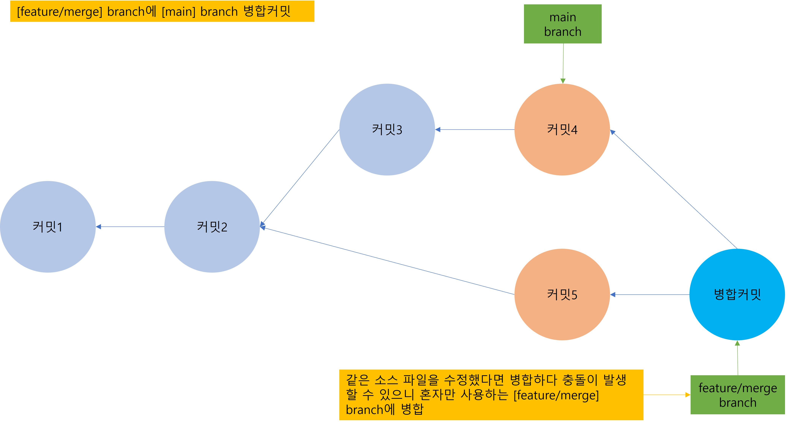

# 1. confilct
## 1. merge(병합 커밋) 및 resolve conflict(충돌 해결)
1. 우리는 지금 fast-forward를 사용해서 [main] branch와 [feature/checkout] branch를 손쉽게 병합했다. 이제 [main] branch와 [feature/merge] branch를 병합하겠다. 두 개의 branch는 현재 동일한 파일을 수정한 상태라 충돌(conflict)가 발생하게 된다. 그래서 충돌 가능성이 있는 코드는 다 같이 사용하는 [main] branch가 아닌 본인 혼자 사용하는 [feature/merge] branch에 병합하도록 한다.
    - 
2. [feature/merge] branch에 병합된 커밋이 문제가 없는 것을 확인하고 [main] branch에 반영한다.
    - 
3. Source Tree에서 [feature/merge] branch를 기준으로 병합하기 위해 [feature/merge] branch로 체크아웃한다.
    - 
4. 병합하려는 커밋인 [main] branch의 최신 커밋을 오른쪽 클릭 후 병합 클릭
    - 
5. 팝업에서 확인 클릭
    - 
6. 충돌이 발생했다는 팝업창이 표출된다. 닫기 버튼을 누른다.
    - 
7. History 탭에 커밋하지 않은 변경사항이 생긴 것을 확인할 수 있다. 커밋하지 않은 변경사항을 클릭하면 branch.md 파일이 스테이지에 올라가지 않을 것을 확인할 수 있고 branch.md 파일을 동시에 수정했기 때문에 충돌이 발생한 것을 알 수 있다. branch.md 파일을 수정해서 다시 병합을 진행하면 된다.
    - 
8. vs code에서 branch.md 파일을 열어보면 Git 충돌이 난 코드를 자동으로 마크한 것을 확인할 수 있다. '======='를 기준으로 위에는 base branch인 [feature/merge] branch의 내용이 아래는 병합 대상인 [main] branch의 내용이 보인다. '<<<<<<< HEAD'위에 버튼들은 각각 어떤식으로 병합할지 처리해주는 vs code의 편의 기능이다. 'Accept Current Change'는 현재 branch의 내용만 남기고 나머지 삭제. 'Accepct Incomming Change'는 병합된 branch의 내용만 남기고 삭제. Accept Both Changes는 현재 branch의 내용과 병합된 branch의 내용을 모두 살린다.
    - 
9. 그럼 고기천은 2번에 branch를 생성하기 전에 협업하는 사람끼리의 규칙을 항상 지정한다.(branch 명명규칙, commit 하는 방식 등) 내용을 추가하고 싶었고 홍길동은 2번에 branch 하나에는 한 명만 commit한다. 내용을 추가하고 싶었다는 것을 판단할 수 있고 두 내용을 다 살리면서 아래 내용을 3번으로 수정해주면 된다. 이 과정에서 '<<<<<<< HEAD', '=======', '>>>>>>> main'은 삭제한다.
    - 
10. Source Tree로 돌아가서 스테이지 아래의 branch.md 파일을 선택하면 오른쪽에 미리보기 창에서 내용을 확인할 수 있다. '<<<<<<< HEAD', '=======', '>>>>>>> main'과 같은 문구가 없고 원하는 대로 코드가 깔끔하게 변경됐으면 충돌이 해결된 것이다. 충돌이 해결된 branch.md 파일을 스테이지에 add한다.
    - 
11. 모든 파일이 스테이지에 올라가면 다시 병합을 재개한다. 커밋 버튼을 눌러서 들어가보면 커밋 메시지가 자동으로 생성되어 있다. branch.md 파일에서 충돌이 났다라는 내용이고 수정해도 좋지만 그냥 커밋한다.
    - 
12. [feature/merge] branch에 병합된 커밋이 올라가 있는 것을 확인할 수 있다.
    - 
13. 원격 저장소의 [feature/merge] branch에도 반영해주기 위해 push를 진행한다.
    - 
14. 이제 병합 커밋이 [feature/merege] branch에 올라간 상태이다. [main] branch에 최신 커밋을 반영하기 위해 [main] branch로 체크아웃한다.
15. History 탭에서 최신 커밋을 오른쪽 클릭 후 병합 선택
    - 
16. [main] branch의 포인터가 최신 커밋으로 이동했고 원격 저장소의 [main] branch에도 반영하기 위해 push 진행
    - 
17. 모든 수정사항이 [main] branch에 반영되었다.
    - 
18. 원격 저장소 확인
    - 